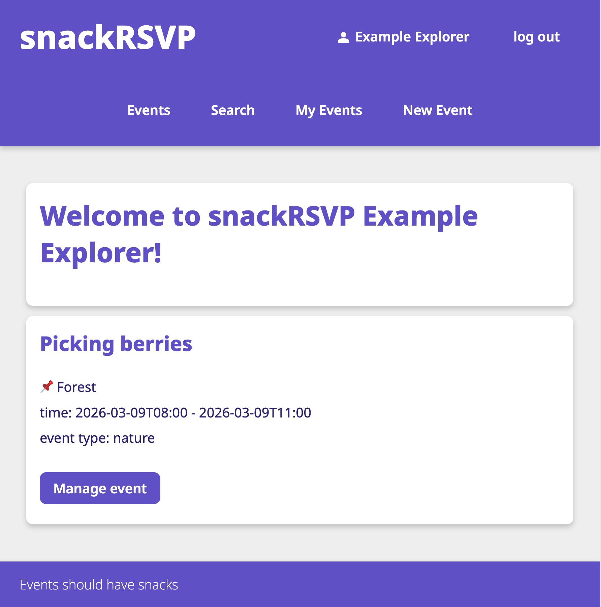

# snackRSVP



A web app to set up events and organize who's bringing what in the table.

## features
* User can sign up and sign in
* User can add, modify and delete events
* User can sign up to events and indicate which snacks they're bringing and their dietary preferences
* User can browse events, and search them by title, location or desciption
* Each event page will contain info on who's coming, what will be served, and which dietary needs should be considered for the confirmed attendees
* The owner of the event can see RSVP's in more detail
* User page will contain a listing of the events they're organizing and attending

## install snackRSVP

install `flask` library:
```
$ pip install flask
```

Initiate the database:
```
$ sqlite3 database.db < schema.sql
$ sqlite3 database.db < init.sql
```

Start the app:
```
$ flask run
```